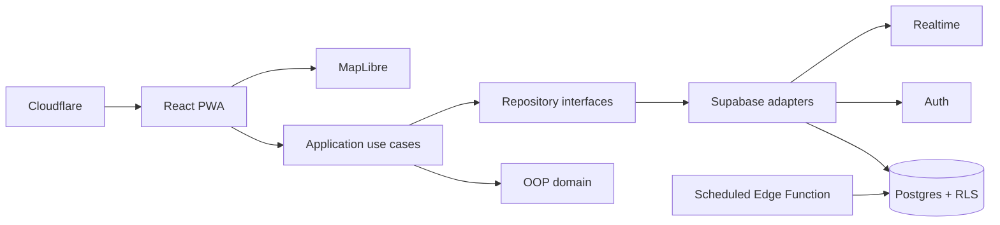

# Architecture

Dependency direction points inward. Domain objects encapsulate group ownership, meetup capacity/status transitions, event time ranges, task completion and location-session expiry. DTO/database records are mapped explicitly at infrastructure boundaries.
